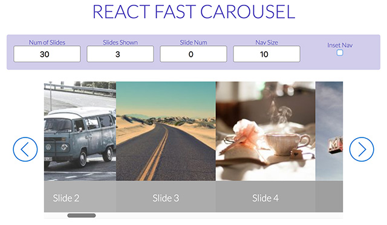

react-fast-carousel
===================

[](http://standardjs.com)



[Live Demo](http://moarwick.github.io/react-fast-carousel)

A no-frills React.js "carousel" component, developed to utilize browser's "native" scrollbar as its primary navigation. Basically, `overflow-x: scroll` with JS navigation hooks. Great when needing to review large quantities of "slides" quickly, or whenever UX calls for it! :)

NOTE: Early version, not tested on mobile...


### Installation
```
npm install react-fast-carousel --save
```

### Usage

```js
import FastCarousel from 'react-fast-carousel';      // ES6+
// or...
var FastCarousel = require('react-fast-carousel').default;
```

Supply your slides as an array of React elements...
```js
const slides = [
  <div>Slide 1</div>,
  <div>Slide 2</div>,
  <div>Slide 3</div>
]

```

The carousel is "responsive" in that it always expands to fill its containing wrapper. Assumes slides have uniform width. 
```jsx
<div className="col-sm-4">
  <FastCarousel slides={slides} />
</div>
```


### Props
Aside from `slides`, all other props ship with defaults...

```
navColor: PropTypes.string,        // Background color of nav panes (rgba)
navIconColor: PropTypes.string     // Color of nav icon (rgba)
navInset: PropTypes.bool,          // Should nav panes appear inside of carousel 
navSize: PropTypes.number,         // Percent width of nav panes (0-100)
slideNum: PropTypes.number,        // Landing slide (zero-based index)
slides: PropTypes.array,           // List of slides (React elems)
slidesShown: PropTypes.number,     // How many slides visible/scrollable at a time
style: PropTypes.object,           // Optional styles object for wrapper
```


### Changelog
**Ver 0.0.1**
* Preview version

